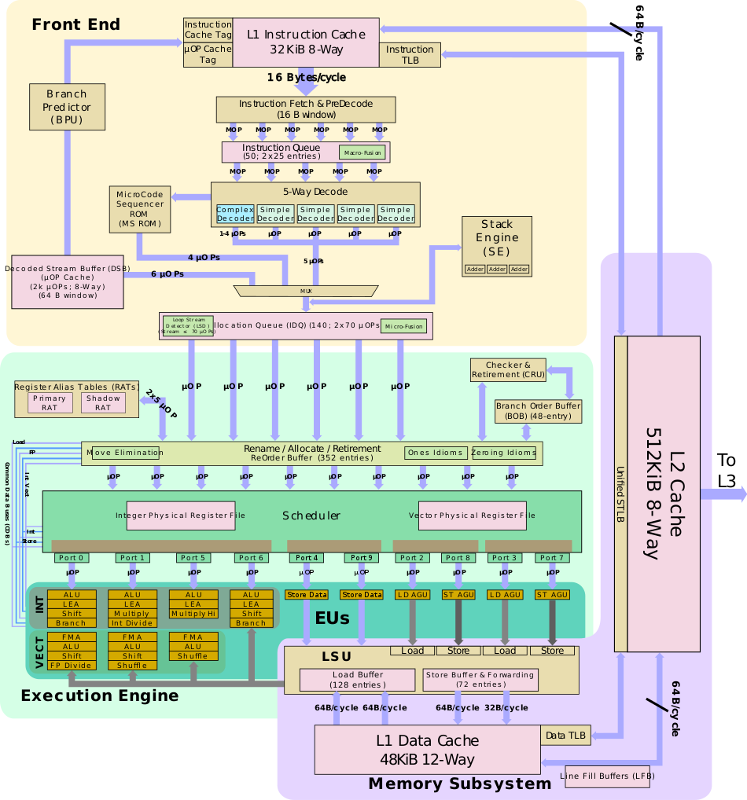
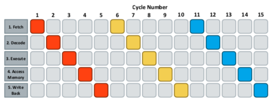
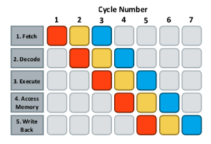
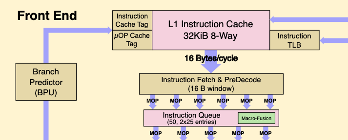
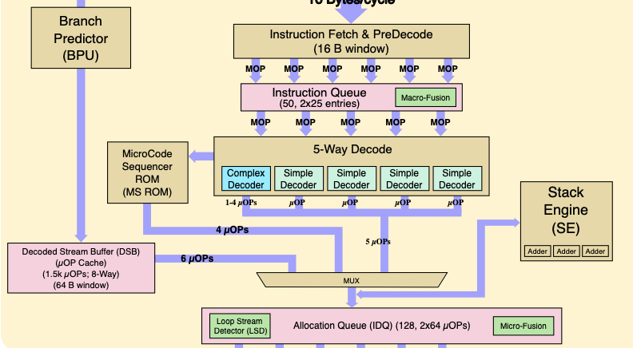
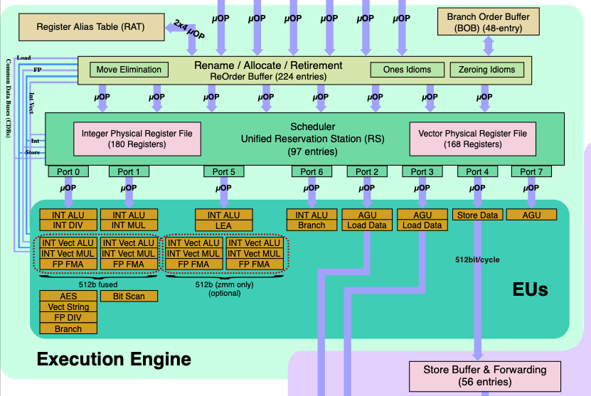
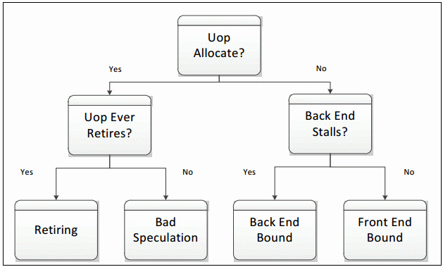
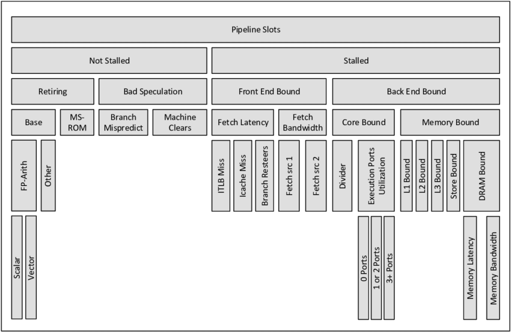

# CPU 微架构

## 微架构简介

微架构性能分析是研究微架构对于指定指令和数据流响应的试验。在研究性能分析之前，对微架构深入了解是非常必要的。
CPU 的微架构由一系列的运算单元、逻辑单元、寄存器等在总线、各个控制线的链接下组成。

在Intel平台，上一代SkyLake处理器微架构如下图所示。
从功能上来说，Intel处理器微架构可以分为三个大部分：

1. 前端（Front End）
2. 执行（Execution Engine）
3. 内存子系统（Memory Subsystem）

这三大模块分别负责1）指令读取、解码；2）微指令调度、执行；3）数据访问等功能。
在进一步对微架构各个模块介绍前，首先对现代超标量处理器流水线执行过程进行介绍，随后将分别介绍不同模块功能和硬件指标。

## CPU 流水线

上面展示的是 CPU 硬件部分，直接对硬件各部分介绍的话内容繁多，因此在对微架构各部件介绍之前，首先对 CPU 工作过程中流水线内容进行介绍，以期对代码执行流程有大致了解，后面对微架构各模块介绍时能够有更深入的认识。

在冯诺依曼型计算机CPU工作过程中，所有工作都可以分为5个阶段：

1. 取指令（Fetch） - 将指令从主存中渠道指令寄存器的过程；
2. 指令译码（Decode） - 按照预定指令格式，对取回指令进行拆分和解释（解码）；
3. 执行指令（Execute） - 完成指令规定各种操作，实现具体指令功能；
4. 访存（Access Memory） - 根据指令需要，访问主存，读取操作数等；
5. 结果写回（Write Back） - 把执行指令阶段的运行结果数据写回存储器中；

在指令执行过程中，为了提高执行速度，需要各个部件并行工作，使得各个部件的操作在时间上重叠，实现流水线作业。
下图分别展示了指令使用非流水线和流水线并行方式执行过程，可以看出采用流水线并行方式后，使用的时钟周期从15降低到7左右。
从原理上说，计算机流水线（Pipeline）就是将一个计算任务细分成若干个子任务，每个子任务都由专门的功能部件进行处理，一个计算任务的各个子任务由流水线上各个功能部件轮流进行处理 （即各子任务在流水线的各个功能阶段并发执行），最终完成工作。

根据计算机流水线执行指令个数，可以分为标量和超标量流水线。在超标量流水线满载时，每个时钟周期执行指令数为2条及以上。超标量流水线处理器是时间并行技术和空间并行计算的综合应用。

在x86平台，为了能够最大限度保证流水线工作效率，避免流水线中断，还采用了多种动态执行技术，包括：

* 乱序执行（Out-Of-Order Execution，OOO） - 允许将多条指令不按顺序而分开发送给电路单元进行处理；
* 分支预测（Branch Prediction）- 对程序流程进行预测，预先读取其中一个分支的指令；

**在性能分析过程中，监控流水线是否中断，判断流水线中断原因，即为微架构性能分析主要内容。而性能优化过程可以通过结合微架构对流水线工作过程进一步优化，避免流水线工作中断，由于此部分内容繁多，本文将不涉及优化内容。**

## Intel CPU 微架构

前面介绍过，Intel微架构按照功能大致可以分为前端、执行和内存子系统三部分。而在流水线执行部分中，可以分为取指令，解码，执行，访存，写回等步骤。

下面将按照Intel微架构模块组成对前端、执行和内存子系统分别进行介绍，在各个子系统模块介绍过程中，主要按照水流线工作流程分别进行介绍。

### 前端

在 CPU 前端，主要负责流水线两部分工作内容，分别是取值和指令译码等工作。
执行端口乱序执行模式不同，前端部分执行都是按照顺序执行。下面将分别对取指令和指令译码两部分工作进行介绍。

#### 取指令

取指令部分由 CPU 前端部分负责，如图{@fig:micro-arch-IF}所示。

处理器在指令执行之前，必须先装载指令，而指令会被预先保存在 L1 指令缓存（I-Cache）中。
SkyLake包含32 KiB大小L1指令缓存单元，采用8路组相联，每个周期可以取16 Bytes长度指令（执行带宽）。
指令实际物理地址通过TLB缓存获取。与缓存系统一样，TLB缓存也是多级缓存系统，一级TLB缓存包括ITLB和DTLB，分别具有128和64个条目，二级TLB缓存为指令和数据共享，共包含1536条目。[^1]

[^1]: Skylake (server) - Microarchitectures - Intel - WikiChip n.d. https://en.wikichip.org/wiki/intel/microarchitectures/skylake_(server) (accessed April 21, 2022).

> L1缓存分为指令缓存和数据缓存两部分

> 在运行程序时，指令和数据地址都是虚拟地址，在运行时需要转换为实际的物理地址以访问cacheline。虚拟地址的转换通过TLB（translation tables）形式维护。这些页表中包含标准4KB对齐地址范围。

取指令单元同时包含了分支预测器（Branch Predictor，BPU）。当分支预测决定走向一个分支后，会将预测指令的地址保存。指令拾取单元进而使用预测指令的地址来取指令。

#### 指令译码

在 x86 处理器中，使用的是复杂指令指令集（CISC）。CISC 指令的长度不固定，执行时间也不相同，导致处理器设计时引起一系列问题。在RISC架构中，指令长度相等，执行时间相同，可以达到很高的频率。与RISC架构类似，Intel处理器在执行引擎中执行的是 uops（微指令），简称为 micro-ops 或 µops。uops 可以对存储在一个或多个寄存器中的数据进行基本操作，包括在寄存器之间或在寄存器与中央处理器(CPU)的外部总线之间传输数据，以及对寄存器进行算术或逻辑操作。而指令译码阶段就是将 x86 指令翻译为对应的 uops，如图{@fig:micro-arch-ID}。

SkyLake 解码器共有 5 个（4个简单解码器和1个复杂解码器）。简单解码器主要是将一条 x86 指令翻译为一条对应的 uops，而复杂解码器会将一些特殊的 x86 指令翻译为 1 到 4 条 uops，如 CPUID、sine 和 cosine 等指令。
对于这些复杂指令，会绕道从MicroCode Sequencer ROM（MS ROM）译码。

尽管解码器共有5个（最多4+1+1+1+1模式8条uops），Intel Core2和更高版本的乱序执行流水线只可以在每个时钟周期发射/重命名4个融合微指令。这主要由 Micro-Funsion 负责，将多个 uops 合并成一条复杂 uops 后，只需要占用流水线一个位置。
在执行时，融合 uops 仍像未融合前一样，发射给多个端口执行。[^2]

[^2]: Cordes P. Answer to “What is the maximum possible IPC can be achieved by Intel Nehalem Microarchitecture?” Stack Overflow 2016.

### 执行引擎

#### 乱序执行指令阶段

执行引擎（Execution Engine）主要负责流水线中乱序执行部分。
乱序执行为了提升指令集并行化设计，在多个执行单元的超标量设计当中，乱序执行引擎是一个很重要的部分，需要进行复杂的调度管理。

乱序执行从Allocator定位器开始，Allocator管理着RAT（Register Alias Table，寄存器别名表）、ROB（Re-Order Buffer，重排序缓冲区）和 RRF（Retirement Register File，退回寄存器文件）。在 Allocator 之前，流水线都是顺序执行的，在 Allocator 之后，就可以进入乱序执行阶段了。

ROB（Re-Order Buffer，重排序缓冲区）是一个缓冲区，它是将乱序执行完毕的指令们按照程序编程的原始顺序重新排序的一个队列，以保证具有因果关系的指令在乱序执行中可以得到正确的数据。
ROB 主要作用是在流水线中负责指令回退（Instruction Retired），以及担当中间计算结果的缓冲区。

RS（Reservation Station，中继站）是执行引擎中另外一个重要模块，其负责等待源数据到来以进行乱序执行，而没有数据的指令将在RS中等待。

#### 执行端口

在将uops执行顺序打乱之后，uops通过每时钟周期4条速度进入RS，总共97条目的RS就开始等待执行引擎乱序执行了。SkyLake包括8个执行端口，每个端口具有多个不同单元以执行不同任务。并非所有端口都是执行计算的，其中4个端口是用来执行内存相关操作的。

### 内存子系统

#### 缓存

在 SkyLake 架构中，包含多级缓存系统。上面介绍过 L1 指令缓存，同时在内存系统中还包含了 32 KiB 大小的 L1 数据缓存（D-Cache）。中级缓存称为 L2 缓存，为数据和指令所共享，大小为 1 MiB。LLC 缓存为非独占设计，尽管这种方式在缓存命中时需要检查数据的一致性，但是 Cache Miss 的时候比独占式具有更好的性能。

在内存子系统中，数据组成连续的字符串形式，以 64 bytes 大小的cacheline形式读取。

* 加载（load）操作会将 cacheline 数据拷贝到寄存器中；
* 存储（store）操作将寄存器数据写回 cacheline 中；

对于 L1 数据缓存（D-Cache），访问延迟在 4 cycle 左右；L2 数据访问延迟在 12 cycles 左右；LLC 访问延迟在 40 周期左右；对于外部设备内存，如网络处理器器和ASIC等，延迟在 140 周期以上。

#### TLB

在程序中数据地址都是虚拟地址，在运行时需要实际的物理地址以访问cacheline。虚拟地址和物理地址间转换通过转换表（translation tables）形式维护。在这些表中包含标准4KB对齐地址的范围称为页。当转换时，其保存在TLB以供未来重用。

如前所述，每个核心都包含一个多级TLB系统。一级缓存包含64和128个TLB条目，分别用于数据和指令缓存；二级共享TLB缓存包含512和条目。

# 性能分析方法论

## 分析原理

在CPU执行过程中，流水线停滞可能有多种原因，如分支预测错误导致取指令错误，从内存或L2/L3缓存中等待数据。特别是分支预测错误会导致CPU执行的有效始终周期数减少。

在对微架构运行性能进行分析时，一个最简单的方法就是判断流水线是否停滞，并且将停滞原因根据流水线工作流程进行分类。

在Intel平台，对微架构整体进行性能分析时，可以按照模块工作是顺序执行或乱序执行，对微架构分为**前端**和**后端**两部分，如图{@fig:intel_arch_overview}所示。图中虚线上面为前端部分，包括取指令，解码，分支预测等，都按照指令顺序执行（In-order）；虚线下面为后端，包括指令执行，访存，写回等，采用乱序执行。

在对微架构进行性能分配时，根据每周期 4 个 uops 是否满载运行进行第一步分析，也就是图{@fig:intel_arch_overview}中星号位置。
通过判断uops是否被Allocator发射给端口执行，可以将时钟周期分为分配与未分配 uops 两大类。
第一类运行的时钟周期可以初步认为是“有效”的，而第二类时钟周期中流水线出现了阻塞情况，主要原因是前/后端缺少相应资源。

尽管在第一类时钟周期内，有足够的 uops 发射到执行端口，但是并非这些 uops 都是有效的，也就是说并非所有 uops 都能够回退（Retired）。例如当分支预测错误时，在 ROB 中的 uops 是无法回退的，因此对应时钟周期也是无效的。

细分第二类阻塞原因，可以将其分为**前端阻塞**和**后端阻塞**两大类：

* 前端阻塞包括以下几部分：
  1. ITLB 事件；
  2. I-Cache事件，包括 L1 I-Cache 和 L2/LLC Cache；
* 后端阻塞包括以下几种情况：
  1. DTLB 事件；
  2. 内存子系统相关事件；
  3. D-Cache事件，包括 L1 D-Cache 和 L2/LLC Cache；
  4. 执行端口阻塞；

在 Intel 架构下，根据上述层次分析方法，可以将微架构性能问题按照图{@fig:TAMA_original}大致分为 4 类（Retiring，Bad Speculation，Front End Bound，Back End Bound）。

## 分析工作流程

按照初步层次分析方法，我们将时钟周期按照图{@fig:TAMA_original}所示分为了4个大类，对各类所出现具体原因进一步分类后，可以得到如图{@fig:TAMA_full}所示全分类微架构性能。
Intel 提供了典型 HPC 应用使用 TAMA 性能分析结果如下表所示。
下面将对不同类别性能问题分别介绍。

| 分类 | Retiring | Back-End Bound | Front-End Bound | Bad Speculation |
| :---: | :---: | :---: | :---: | :---: |
| 百分比 | 30-70% | 20-40% | 5-10% | 1-5% |